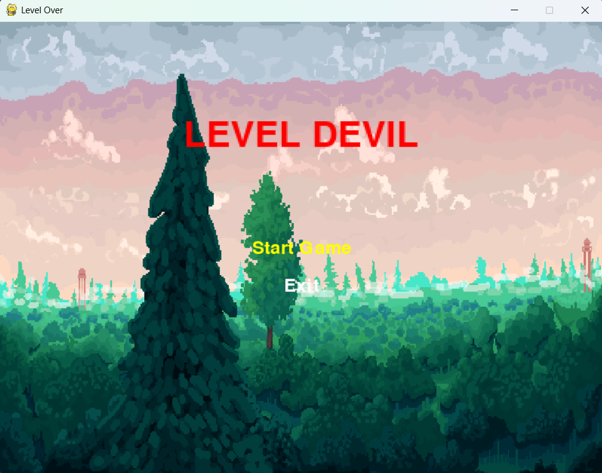
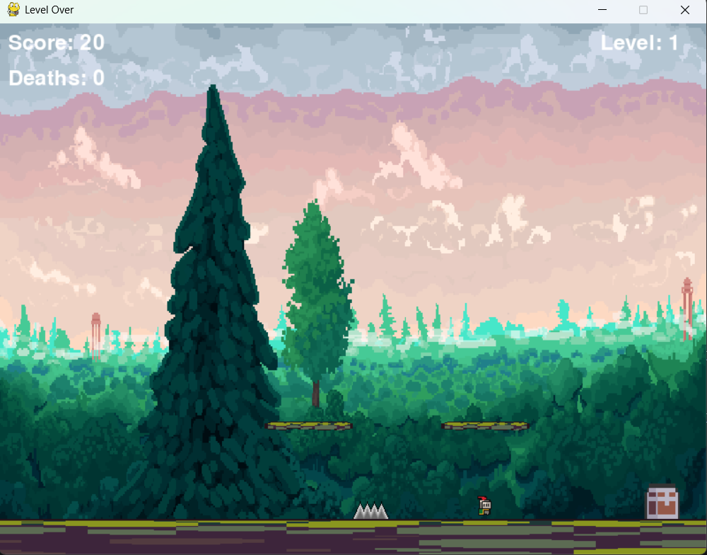

# 🎮 Level Devil Tarzı 2D Platform Oyunu

Bu proje, CENG 220 dersi kapsamında geliştirilen Level Devil tarzı, 2 boyutlu, tuzaklı bir platform oyunudur. Python ve Pygame kullanılarak tasarlanmıştır.

## 📌 Oyun Hakkında

Oyunda amaç, oyuncunun farkında olmadan değişen platformlar ve tuzaklarla dolu seviyeleri tamamlamasıdır. Oyuncunun refleksleri, dikkat seviyesi ve ezber yeteneği test edilir.

- Geliştiriciler: Ayşe Semra YASLAN, Selimhan TOKAT, Şeyda BOZDAĞ
- Programlama Dili: Python
- Kütüphaneler: Pygame
- Geliştirme Ortamı: Visual Studio Code (Windows)

## 🎮 Oynanıştan Görseller

### Başlangıç Ekranı


### Oyun İçi Görüntü


## 🔧 Kurulum ve Çalıştırma

```bash
git clone https://github.com/seydabozdag/level_over.git
cd level_over
pip install -r requirements.txt
python main.py
```
